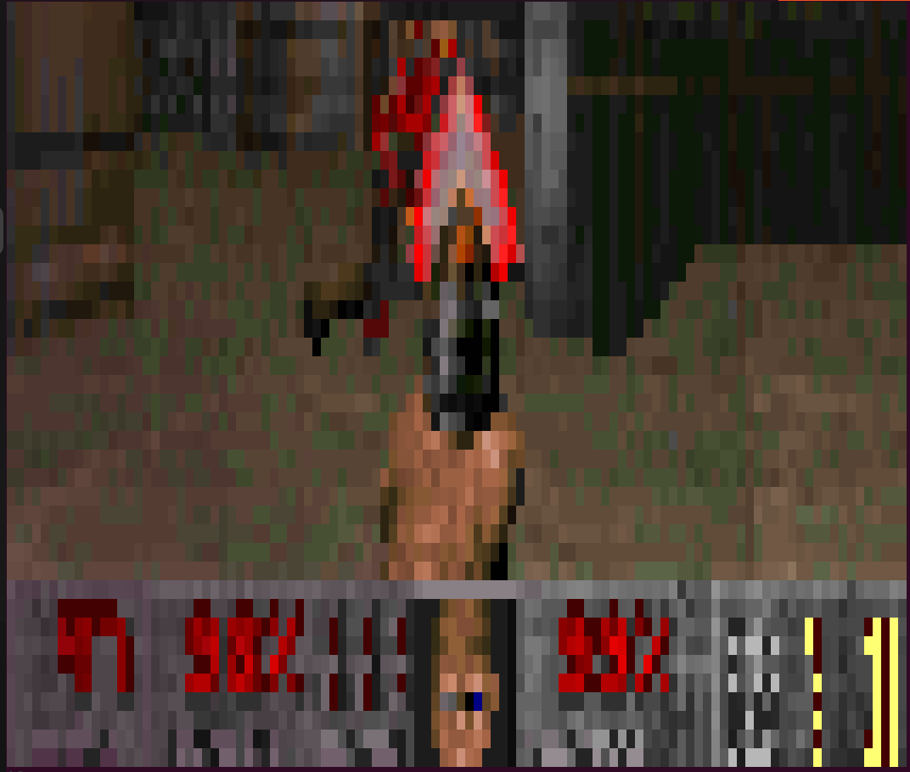

# DOOM-ASCII PIXELADO



**Text-based DOOM in your terminal!**

Source-port of [doomgeneric](https://github.com/ozkl/doomgeneric). Does not have sound.

## Novidades e Melhorias

Este projeto foi aprimorado com as seguintes modificações em relação ao original:

- **Inicialização mais rápida**: Melhorias no tempo de inicialização do jogo.
- **Otimizações em Assembly**:
  - Salvamento otimizado em assembly.
  - Captura dos inputs do teclado com buffer em assembly para reduzir o input lag.
- **Geração de ASCII aprimorada**: Agora com caracteres especiais, trazendo mais detalhes e variabilidade visual.
- **Novo buffer de escrita**: Os caracteres são processados e escritos de uma vez no terminal, reduzindo o tearing dos frames e melhorando a fluidez.
- **Tratamento de borda com sombras**: Adicionadas sombras para criar uma sensação de profundidade no jogo.

## Link para o vídeo das modificações

Você pode assistir às modificações do projeto neste vídeo: [Assista aqui](https://drive.google.com/file/d/1Lwca3lG_SEARQ3-J5x3Wu2Kjtb5onwSy/view?usp=sharing).

## Build
Binaries for Windows and Linux are provided as GitHub releases.

### Linux / Mac
Requires Make and a C compiler. Creates ```doom_ascii/doom_ascii```
